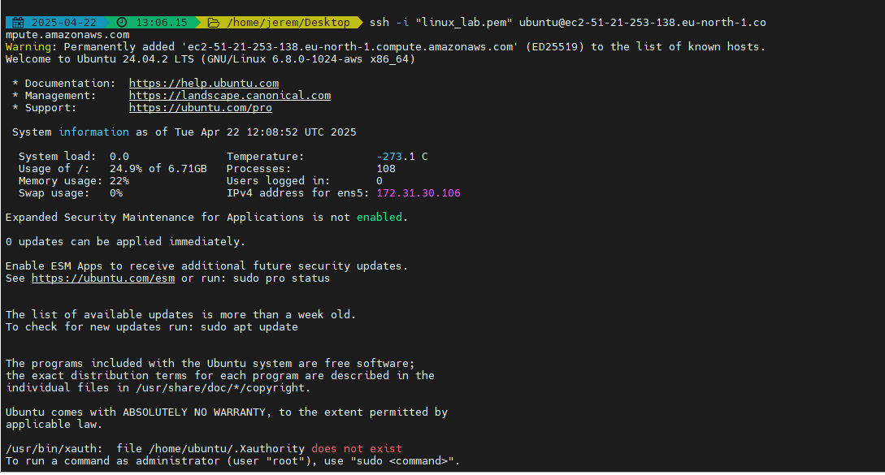

# linux_fundamentals
This project covers the essential concepts of Linux system setup, package management, and remote server connectivity. Below are the steps taken to complete all required tasks successfully.

## Steps Completed

### 1. Launching an EC2 Instance
- A cloud-based **EC2 instance** was successfully launched.


### 2. Connecting to the Server
- Connected and logged into the **EC2 instance** using **MobaXterm** via SSH. 


### 3. Installing, Updating, and Removing Software
#### **Updating Package Lists**
- Ran the command:
  ```bash
  sudo apt update


- Installing Software:
  ```bash
  sudo apt install tree


- Verified installation with:
  ```bash
  tree / 1


- Updated installed packages with:
  ```bash
  sudo apt upgrade


- Removed the Tree package using:
  ```bash
  sudo apt remove tree


### 4. Additional Practice - Installing Nginx
#### **Installed Nginx as an additional practice step**
- Ran the command:
  ```bash
  sudo apt install nginx

